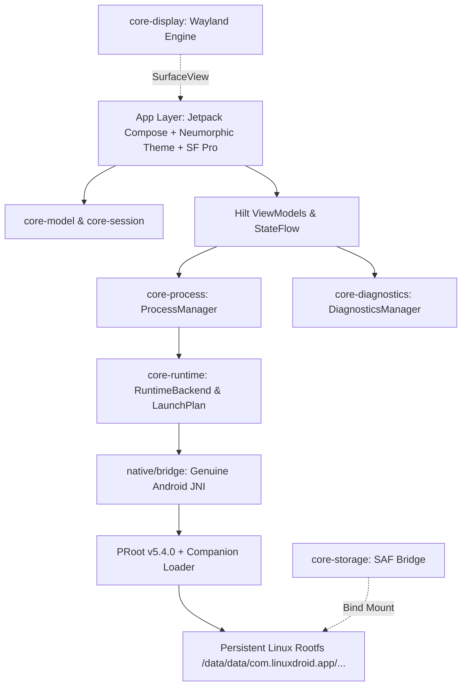
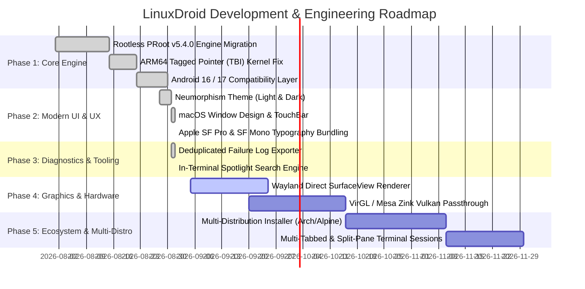

# LinuxDroid

<div align="center">

```
  _      _                      _____                 _       _ 
 | |    (_)                    |  __ \               (_)     | |
 | |     _ _ __  _   ___  __   | |  | |_ __ ___  _ __ _  ___ | |
 | |    | | '_ \| | | \ \/ /   | |  | | '__/ _ \| '__| |/ _ \| |
 | |____| | | | | |_| |>  <    | |__| | | | (_) | |  | | (_) |_|
 |______|_|_| |_|\__,_/_/\_\   |_____/|_|  \___/|_|  |_|\___/(_)
```

### *True Persistent, Rootless Linux Userspace on Android*

[-3DDC84?logo=android&logoColor=white)](https://developer.android.com)
[-brightgreen?logo=android)](https://developer.android.com)
[](https://kotlinlang.org)
[](https://gradle.org)
[](LICENSE)
[](#system-specifications)
[](https://github.com/InfidelRahul/LinuxDroid)

[Features](#-key-features) • [Architecture](#-architecture) • [Module Structure](#-modular-architecture) • [Getting Started](#-building--installation) • [Documentation](#-documentation-index) • [Roadmap](#-project-roadmap)

---

</div>

## 📖 Overview

**LinuxDroid** is a modern, native Android application engineered to run a complete, persistent, rootless Linux distribution directly on Android hardware. 

Unlike traditional solutions that depend on root access, QEMU/KVM virtual machine emulation, custom kernels, or fragile chroot hacks, LinuxDroid utilizes a hardened userspace syscall interception architecture based on **PRoot** (`ptrace(2)` and `seccomp`). Linux binaries execute directly on the bare-metal CPU with zero virtualization overhead.

---

## ⚡ Key Features

### 🛡️ 100% Rootless & Containerless
* **No Root Required**: Operates completely inside the standard Android application sandbox.
* **No VM Overhead**: Code executes at native CPU clock speed without hypervisor translation.
* **No Custom Kernel Required**: Runs out-of-the-box on standard production Android kernels (Linux 4.14 through 6.6+ on Android 16).
* **Persistent Rootfs**: Your Linux environment is preserved across app updates, device reboots, and session terminations.

### 🎨 macOS-Inspired Neumorphic UI
* **Soft Neumorphism Engine**: Custom elevation shaders supporting both Light and Dark mode with adaptive contrast normalization.
* **macOS Window Experience**: Titlebars with interactive traffic lights (`Close`, `Minimize`, `Maximize`), frosted glass vibrancy, and telemetry status pills.
* **Integrated Apple Typography**: Bundled official **San Francisco (SF Pro)** for UI navigation and **San Francisco Mono (SF Mono)** / **JetBrains Mono** for monospaced coding.

### 💻 Pro Terminal Emulator
* **Real PTY Subsystem**: Native POSIX pseudo-terminal (`openpty`, `termios`, `ioctl(TIOCSWINSZ)`) for interactive shell sessions.
* **Spotlight-Style Search**: In-terminal keyword search with match counter (`1/5`) and live jump navigation.
* **TouchBar Extra Keys**: Tactile modifier bar with hardware-like LED status indicators for `CTRL`, `ALT`, `ESC`, `TAB`, arrows, and pipe symbols.
* **ANSI 256-Color Palette**: High-contrast, theme-aware terminal color mapper preventing unreadable dark-on-dark or light-on-light output.

### 📂 Storage & Host Integration
* **Scoped Storage Bridge**: Seamless bi-directional file sharing between Android `/sdcard/LinuxDroid` and Linux guest `/home/user/Android`.
* **Hardware Diagnostics**: Real-time SoC telemetry (CPU cores, RAM usage, storage space, kernel release, SELinux status).
* **Failure Log Exporter**: Deduplicated error aggregation, causal chain tracking, and one-click JSON/plain-text diagnostic export.

---

## 📊 System Specifications

| Specification | Details |
| :--- | :--- |
| **Minimum Android Version** | Android 9.0 (API level 28) |
| **Target Android Version** | Android 16 / 17 (API level 36) |
| **Supported Architectures** | `arm64-v8a` (Primary), `x86_64` |
| **Default Distribution** | Debian 12 (Bookworm) / Ubuntu 24.04 LTS (Noble Numbat) |
| **Runtime Engine** | PRoot v5.4.0 (Hardened with Bionic Ptrace & Tagged Pointer normalization) |
| **Display Architecture** | Wayland Native Protocol (`wl_compositor`, `wl_shm`), XWayland for legacy X11 |
| **Build Toolchain** | Java 17/21 • Gradle 9.7.1 • AGP 9.3.2 • Kotlin 2.3.20 • NDK r29 |

---

## 🏛️ Architecture

LinuxDroid is structured into 17 clean, decoupled Gradle modules following Google's modern Android architecture guidelines:



### Execution Pipeline

1. **Launcher**: `RuntimeLaunchPlan` prepares environment variables, bind mounts (`/proc`, `/sys`, `/dev`, `/sdcard/LinuxDroid`), and guest working paths.
2. **JNI Layer**: `native/bridge` forks a child process, configures the PTY master/slave pair, and applies file descriptor handoffs.
3. **PRoot Engine**: The companion loader initializes memory address translation, normalizes ARM64 Top-Byte-Ignore (TBI) pointers, and intercepts guest syscalls via `ptrace(2)`.
4. **Guest Shell**: Debian/Ubuntu user space boots, spawning `/usr/bin/bash` with full package management (`apt`, `dpkg`) access.

---

## 📦 Modular Architecture

```
LinuxDroid/
├── app/                      # Application shell, Navigation, Compose UI, Hilt DI root
│   └── src/main/res/font/    # Bundled Apple SF Pro & SF Mono typography
├── core/
│   ├── core-model/           # Domain models (Environment, Session, Process, Telemetry)
│   ├── core-logging/         # High-performance structured logging subsystem
│   ├── core-database/        # Room Database for Android environment metadata
│   ├── core-runtime/         # PRoot backend abstraction and launch plan validator
│   ├── core-process/         # Process execution supervisor and lifecycle tracking
│   ├── core-session/         # Terminal PTY session coordinator
│   ├── core-filesystem/      # Rootfs storage validation and atomic path manager
│   ├── core-storage/         # Scoped Storage / SAF shared folder bridge
│   ├── core-display/         # Wayland compositor protocol and surface renderer
│   ├── core-gpu/             # GPU acceleration interfaces (VirGL / Mesa Zink)
│   ├── core-input/           # Virtual keyboard, mouse, and touch input handler
│   ├── core-audio/           # Audio output bridge (PulseAudio / AAudio)
│   ├── core-network/         # Network state monitor and port forwarder
│   ├── core-package/         # Linux package manager abstraction
│   └── core-diagnostics/     # Deduplicated error aggregation and log export
├── native/
│   └── bridge/               # JNI bridge (POSIX openpty, process forks, signal handling)
├── linux/
│   └── bootstrap/            # Rootfs streaming download, verify, and extraction
└── docs/                     # Comprehensive architectural and subsystem documentation
```

---

## 📚 Documentation Index

Explore our comprehensive technical documentation:

| Document | Description |
| :--- | :--- |
| 📘 [Architecture Overview](docs/architecture/overview.md) | High-level system architecture and component interactions |
| 📐 [Architecture Blueprint](docs/architecture/blueprint.md) | Detailed subsystem specifications and data flow models |
| ⚙️ [Rootless PRoot Runtime](docs/runtime/rootless-runtime.md) | In-depth breakdown of `ptrace` syscall emulation and TBI fix |
| 📱 [Android Integration](docs/architecture/android.md) | Lifecycle management, Foreground Services, and Jetpack Compose |
| 🔌 [Native JNI Bridge](docs/architecture/native.md) | POSIX PTY handoff, termios control, and native error boundaries |
| 🖥️ [Wayland Display](docs/display/wayland.md) | Direct Wayland compositor implementation and client rendering |
| 🧱 [Weston / libweston Dependency](docs/display/weston.md) | Pinned Weston 16.0.0 + matching libweston ARM64 Android build dependency (Milestone 1) |
| 🖥️ [libweston Compositor Init](docs/display/libweston-compositor.md) | Embedded libweston compositor startup + LinuxDroid custom backend (Phase 3) |
| 🪟 [XWayland Integration](docs/display/xwayland.md) | Running legacy X11 GUI applications inside Wayland |
| 🎮 [GPU Acceleration](docs/display/gpu.md) | VirGL / Mesa Zink Vulkan passthrough architecture |
| 📁 [Storage & Shared Folders](docs/storage/storage.md) | Scoped storage, SAF permissions, and bind-mount rules |
| 🔒 [Security Model](docs/security/security.md) | Sandboxing, SELinux compatibility, and privilege boundaries |
| 🧪 [Testing Guide](docs/testing/testing.md) | Unit test suite, integration tests, and mock strategies |
| 🛠️ [Build & Compilation Guide](docs/development/build.md) | Toolchain setup, NDK build flags, and release signing |

---

## 🚀 Building & Installation

### Prerequisites
- **JDK**: Java 17 or 21 (Temurin / OpenJDK). *(Java 25 is not supported due to Kotlin compiler compatibility)*.
- **Android SDK**: API 35 / 36 with Build-Tools `35.0.0`+.
- **Android NDK**: NDK `r27` or `r29` (`27.2.12479018`+).

### Quick Build Commands

```bash
# 1. Clone the repository
git clone https://github.com/InfidelRahul/LinuxDroid.git
cd LinuxDroid

# 2. Configure Environment Variables
export ANDROID_HOME=/path/to/android-sdk
export ANDROID_NDK_ROOT=$ANDROID_HOME/ndk/27.2.12479018

# 3. Run full test suite (374 unit tests)
./gradlew test

# 4. Assemble Debug APK
./gradlew assembleDebug

# 5. Assemble Release Signed APK
./gradlew assembleRelease
```

The compiled APK will be located at:
`app/build/outputs/apk/debug/app-debug.apk`

---

## 🗺️ Project Roadmap



### ✅ Milestones Achieved
- [x] **Modular Decoupling**: Refactored monolithic codebase into 17 clean-architecture Gradle modules.
- [x] **Android 16+ Kernel Hardening**: Intercepted and emulated trapped seccomp syscalls (`rseq`, `clone3`, `faccessat2`) with proper errno fallback.
- [x] **Zero-Root Persistent Storage**: Integrated rootfs preservation in app private data with automatic SAF shared storage bind mounting.
- [x] **Pro macOS Neumorphic Terminal**: Full ANSI 256-color support, touch key bar with LED toggles, Spotlight search, and dynamic PTY resizing.
- [x] **Official Apple Typography**: Bundled SF Pro & SF Mono font weights for an elite developer interface.
- [x] **Failure Diagnostics System**: Live causal chains and one-click shareable log export.

### 🔮 Upcoming Milestones
- [ ] **Hardware GPU Passthrough**: VirGL / Zink Vulkan hardware-accelerated OpenGL/ES rendering.
- [ ] **Low-Latency Wayland SurfaceView**: Direct touch-to-framebuffer Wayland client compositor.
- [ ] **PulseAudio Daemon Integration**: Seamless guest-to-host audio streaming using Android AAudio.
- [ ] **Distribution Hub**: One-tap installation for Arch Linux, Alpine Linux, Fedora, and Kali Linux.
- [ ] **Multi-Tab Sessions**: Simultaneous parallel shell sessions with split-screen tiling.

---

## 👨‍💻 Developer & Maintainer

<div align="center">

**Crafted with passion by [InfidelRahul](https://github.com/InfidelRahul)**

[](https://github.com/InfidelRahul)
[](https://github.com/InfidelRahul/LinuxDroid/issues)

</div>

---

## 📄 License

```text
Copyright 2026 Rahul Kumar (InfidelRahul)

Licensed under the Apache License, Version 2.0 (the "License");
you may not use this file except in compliance with the License.
You may obtain a copy of the License at

    http://www.apache.org/licenses/LICENSE-2.0

Unless required by applicable law or agreed to in writing, software
distributed under the License is distributed on an "AS IS" BASIS,
WITHOUT WARRANTIES OR CONDITIONS OF ANY KIND, either express or implied.
See the License for the specific language governing permissions and
limitations under the License.
```
