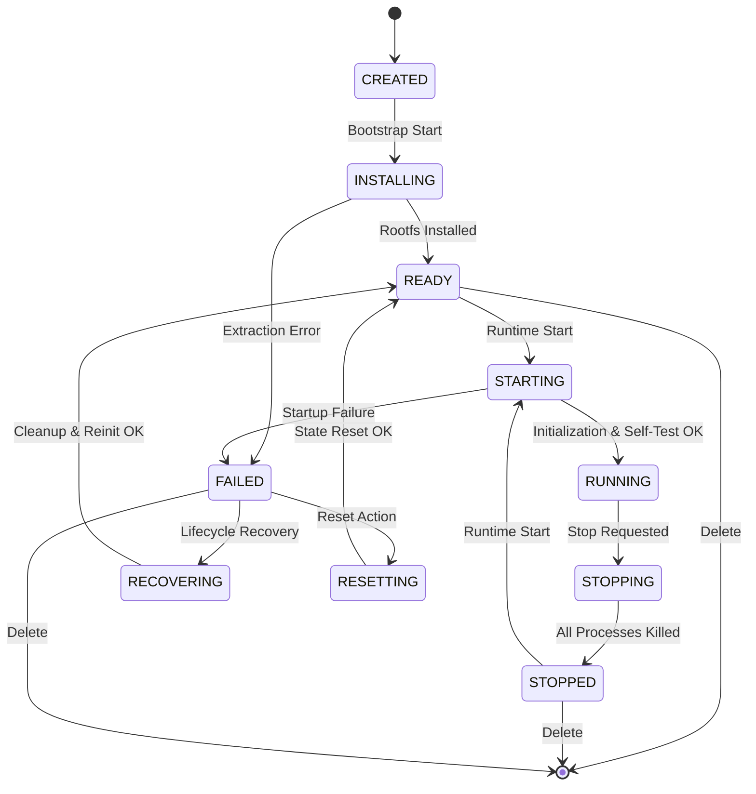

# LinuxDroid Architecture Blueprint

```text
┌────────────────────────────────────────────────────────────────────────────────────────┐
│                                   LINUXDROID APP LAYER                                 │
│  ┌────────────────────────┐  ┌────────────────────────┐  ┌──────────────────────────┐  │
│  │   EnvironmentScreen    │  │     TerminalScreen     │  │      SettingsScreen      │  │
│  └───────────┬────────────┘  └───────────┬────────────┘  └────────────┬─────────────┘  │
│              ▼                           ▼                            ▼                │
│  ┌────────────────────────┐  ┌────────────────────────┐  ┌──────────────────────────┐  │
│  │  EnvironmentViewModel  │  │   TerminalViewModel    │  │    SettingsViewModel     │  │
│  └───────────┬────────────┘  └───────────┬────────────┘  └──────────────────────────┘  │
└──────────────┼───────────────────────────┼─────────────────────────────────────────────┘
               │                           │
               ▼                           ▼
┌────────────────────────────────────────────────────────────────────────────────────────┐
│                               CORE ORCHESTRATION LAYER                                 │
│  ┌──────────────────────────────────────────────────────────────────────────────────┐  │
│  │                               ProotRuntimeBackend                                │  │
│  │   - Lifecycle Management (start, stop, restart, recover)                         │  │
│  │   - Process & Session Registry                                                   │  │
│  └───────────┬───────────────────────────────────────────┬──────────────────────────┘  │
│              ▼                                           ▼                             │
│  ┌────────────────────────┐                  ┌────────────────────────┐                │
│  │  RuntimeAssetsManager  │                  │     RuntimeLauncher    │                │
│  │  - Assets Validation   │                  │  - Environment Cleared │                │
│  │  - Version Currency    │                  │  - Launch Orchestrator │                │
│  └────────────────────────┘                  └─────┬────────────┬─────┘                │
└────────────────────────────────────────────────────┼────────────┼──────────────────────┘
                                                     │            │
                                    ┌────────────────┘            └───────────────┐
                                    ▼                                             ▼
┌───────────────────────────────────────────────────┐  ┌─────────────────────────────────┐
│              PROCESS LAUNCH PATH                  │  │          PTY LAUNCH PATH        │
│  ┌─────────────────────────────────────────────┐  │  │  ┌────────────────────────────┐ │
│  │                ProcessBuilder               │  │  │  │        NativeBridge        │ │
│  │   - env.clear() (Host sanitized)            │  │  │  │  - openpty() / setsid()   │ │
│  │   - PROOT_LOADER / PROOT_TMP_DIR            │  │  │  │  - TIOCSCTTY / dup2()      │ │
│  │   - Non-interactive execution               │  │  │  │  - execve(proot, argv, env)│ │
│  └─────────────────────────────────────────────┘  │  │  └────────────────────────────┘ │
└─────────────────────────┬─────────────────────────┘  └────────────────┬────────────────┘
                          │                                             │
                          └──────────────────────┬──────────────────────┘
                                                 ▼
┌────────────────────────────────────────────────────────────────────────────────────────┐
│                              LINUXDROID_PROOT NATIVE ENGINE                            │
│  ┌──────────────────────────────────────────────────────────────────────────────────┐  │
│  │                                     CLI Entry                                    │  │
│  │   - Arguments: -0 --kill-on-exit --link2symlink -r <rootfs> -b <mounts> -w <cwd> │  │
│  │   - launch_process(): ptrace(TRACEME) + kill(SIGSTOP)                            │  │
│  └───────────────────────────────────────────┬──────────────────────────────────────┘  │
│                                              ▼                                         │
│  ┌──────────────────────────────────────────────────────────────────────────────────┐  │
│  │                             Tracer Synchronization                               │  │
│  │   - Catch SIGSTOP: ptrace(PTRACE_SETOPTIONS, ... PTRACE_O_TRACESECCOMP)          │  │
│  │   - Child installs seccomp mode 2 filter and invokes guest execve()              │  │
│  └───────────────────────────────────────────┬──────────────────────────────────────┘  │
│                                              ▼                                         │
│  ┌──────────────────────────────────────────────────────────────────────────────────┐  │
│  │                           Guest execve() Interception                            │  │
│  │   - sysenter: translate_execve_enter() reads target ELF, substitutes loader      │  │
│  │   - sysexit:  transfer_load_script() writes mmap instructions to sp - buffer_sz  │  │
│  │   - Registers: set USERARG_1 (x0) and sp to script; restore_original_regs=false  │  │
│  └───────────────────────────────────────────┬──────────────────────────────────────┘  │
└──────────────────────────────────────────────┼─────────────────────────────────────────┘
                                               │
                                               ▼
┌────────────────────────────────────────────────────────────────────────────────────────┐
│                                GUEST EXECUTION SPACE                                   │
│  ┌──────────────────────────────────────────────────────────────────────────────────┐  │
│  │                              PRoot Static Loader                                 │  │
│  │   - _start(cursor): executes load script (mmap guest ELF & interpreter)          │  │
│  │   - Updates auxv (AT_PHDR, AT_ENTRY, AT_BASE)                                    │  │
│  │   - BRANCH: mov sp, stack_pointer; mov x0, 0; br entry_point                     │  │
│  └───────────────────────────────────────────┬──────────────────────────────────────┘  │
│                                              ▼                                         │
│  ┌──────────────────────────────────────────────────────────────────────────────────┐  │
│  │                             GNU Dynamic Linker                                   │  │
│  │   - ld-linux-aarch64.so.1 loads libc.so.6, libtinfo.so.6, etc.                   │  │
│  │   - Syscalls intercepted & translated by PRoot to rootfs guest namespace         │  │
│  └───────────────────────────────────────────┬──────────────────────────────────────┘  │
│                                              ▼                                         │
│  ┌──────────────────────────────────────────────────────────────────────────────────┐  │
│  │                           Interactive Shell / Workload                           │  │
│  │   - /usr/bin/bash -l (Debian 13 / Ubuntu / Kali ARM64 userspace)                 │  │
│  │   - Connected to persistent PTY session                                          │  │
│  └──────────────────────────────────────────────────────────────────────────────────┘  │
└────────────────────────────────────────────────────────────────────────────────────────┘
```

---

## 1. System Architecture & Module Boundaries

LinuxDroid is organized into two distinct repositories to maintain separation of concerns between Android application orchestration and native C runtime engine internals:

```mermaid
graph TD
    subgraph Repo1 ["LinuxDroid (Android App & Orchestration)"]
        UI[UI Screens & Compose Components]
        VM[ViewModels & State Flows]
        RT[core-runtime & ProotRuntimeBackend]
        NB[native-bridge / JNI openpty]
        BOOT[linux-bootstrap Rootfs Manager]
    end

    subgraph Repo2 ["LinuxDroid_proot (Native Userspace Engine)"]
        PROOT_BIN[proot ELF executable]
        LOADER_BIN[libproot_loader static ARM64 binary]
        SECCOMP[Seccomp BPF Accelerator & Ptrace Handler]
        TRANSLATE[Syscall & Path Virtualization Layer]
    end

    subgraph GuestSpace ["Guest Linux Environment"]
        ROOTFS[ARM64 Rootfs: Debian 13 / Ubuntu / Kali]
        GLIBC[ld-linux-aarch64.so.1 Dynamic Linker]
        BASH[/usr/bin/bash Login Shell]
    end

    UI --> VM
    VM --> RT
    RT --> NB
    RT --> BOOT
    RT -. consumes .-> PROOT_BIN
    RT -. consumes .-> LOADER_BIN
    NB --> PROOT_BIN
    PROOT_BIN --> LOADER_BIN
    LOADER_BIN --> GLIBC
    GLIBC --> BASH
    BASH --> ROOTFS
```

---

## 2. Process & PTY Execution Paths

The runtime exposes two identical execution paths configured from the same `RuntimeSpec`:

### A. Non-Interactive Process Execution (`launchProcess`)
- **Use Case**: Diagnostics, `/bin/true` verification, single command execution, background tasks.
- **Mechanism**: Java `ProcessBuilder` with sanitized, isolated environment (`env.clear()`).
- **Standard Streams**: Standard Java `InputStream`, `OutputStream`, `ErrorStream`.

### B. Interactive Terminal Execution (`launchPty`)
- **Use Case**: Login shell (`/bin/bash -l`), interactive terminal sessions.
- **Mechanism**: `NativeBridge.nativeCreatePtyProcess` via JNI:
  1. `openpty(&master_fd, &slave_fd, NULL, NULL, &ws)`
  2. `fork()`
  3. Child calls `setsid()`, `ioctl(slave_fd, TIOCSCTTY, 0)`, `dup2(slave_fd, STDIN/STDOUT/STDERR)`, `close(master_fd)`, `execve(proot, argv, envp)`.
  4. Parent closes `slave_fd` and returns `master_fd` and `pid`.
  5. `TerminalViewModel` continuously drains `master_fd` via coroutine until `read() < 0`.

---

## 3. Tracer, Seccomp, and Loader Lifecycle Sequence

```mermaid
sequenceDiagram
    autonumber
    participant Tracer as PRoot Tracer
    participant Kernel as Linux Kernel (Android)
    participant Tracee as Child Process
    participant Loader as PRoot Static Loader
    participant Guest as Guest ELF (/usr/bin/bash)

    Tracee->>Kernel: ptrace(PTRACE_TRACEME)
    Tracee->>Kernel: kill(getpid(), SIGSTOP)
    Kernel->>Tracer: SIGSTOP notification
    Tracer->>Kernel: ptrace(PTRACE_SETOPTIONS, PTRACE_O_TRACESECCOMP)
    Tracer->>Kernel: PTRACE_SYSCALL restart
    Tracee->>Kernel: prctl(PR_SET_SECCOMP, SECCOMP_MODE_FILTER)
    Tracee->>Kernel: execve("/usr/bin/bash")
    Kernel->>Tracer: SECCOMP_RET_TRACE / sysenter event
    Note over Tracer: translate_execve_enter()<br/>Extract ELF load info & interpreter<br/>Rewire path argument to PROOT_LOADER
    Tracer->>Kernel: PTRACE_SYSCALL restart
    Kernel->>Tracee: Load static loader ELF
    Kernel->>Tracer: sysexit event (loader loaded)
    Note over Tracer: transfer_load_script()<br/>Write load script to sp - buffer_size<br/>Set x0 (USERARG_1) = load script<br/>Set tracee->restore_original_regs = false
    Tracer->>Kernel: PTRACE_SYSCALL restart
    Tracee->>Loader: _start(cursor = x0)
    Note over Loader: Parse load script<br/>mmap /usr/bin/bash segments<br/>mmap ld-linux-aarch64.so.1 segments<br/>Adjust auxv (AT_PHDR, AT_ENTRY)
    Loader->>Guest: BRANCH: mov sp, stack; mov x0, 0; br ld_entry
    Note over Guest: GNU ld.so initializes & calls /usr/bin/bash main()
```

---

## 4. State Machine & Recovery Lifecycle

The state machine strictly governs valid lifecycle transitions to guarantee clean resource recovery without orphaned processes or stale terminal states:



### Recovery Invariant:
When an environment enters `FAILED` state (e.g. from an unhandled process termination or startup error):
1. `runtimeBackend.stop(env)` sends `SIGTERM`/`SIGKILL` to all active handles for the environment.
2. `runtimeBackend.initialize(env)` recreates clean `/tmp` and log storage directories.
3. State transitions formally: `FAILED` → `RECOVERING` → `READY` → `STARTING` → `RUNNING`.

---

## 5. Security & Isolation Matrix

| Component | Policy / Mechanism | Purpose |
|---|---|---|
| **Host Environment** | `env.clear()` | Removes all Android host variables (`LD_PRELOAD`, `BOOTCLASSPATH`, `ANDROID_*`) |
| **Address Tagging** | `normalize_tracee_address` | Clears Top-Byte-Ignore (TBI) and Memory Tagging Extension (MTE) bits on ARM64 |
| **File Permissions** | `--link2symlink` | Emulates POSIX hardlinks as symlinks on Android private storage filesystems |
| **UID / GID Virtualization** | `-0` (fake_id0) | Emulates root UID (0) and GID (0) in userspace for package management & shell operations |
| **Namespace Isolation** | `-r <rootfsPath>` | Confinement of all file paths relative to guest `/` rootfs |
| **Terminal Isolation** | `setsid()` + `TIOCSCTTY` | Allocates distinct process session and controlling pseudo-terminal per interactive session |
